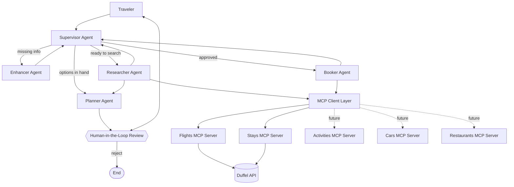
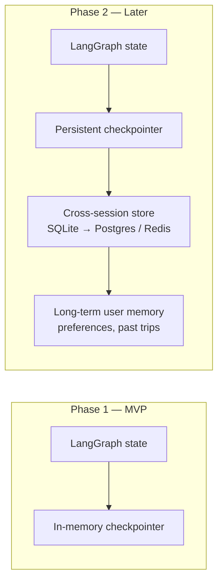
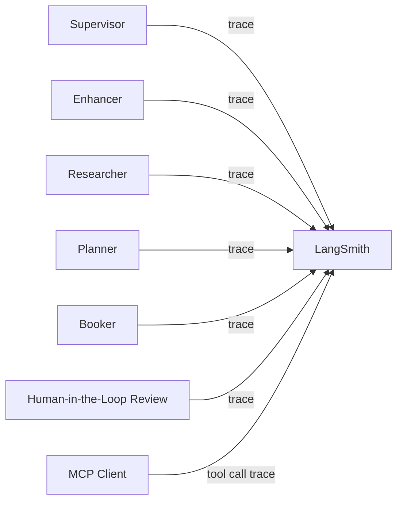
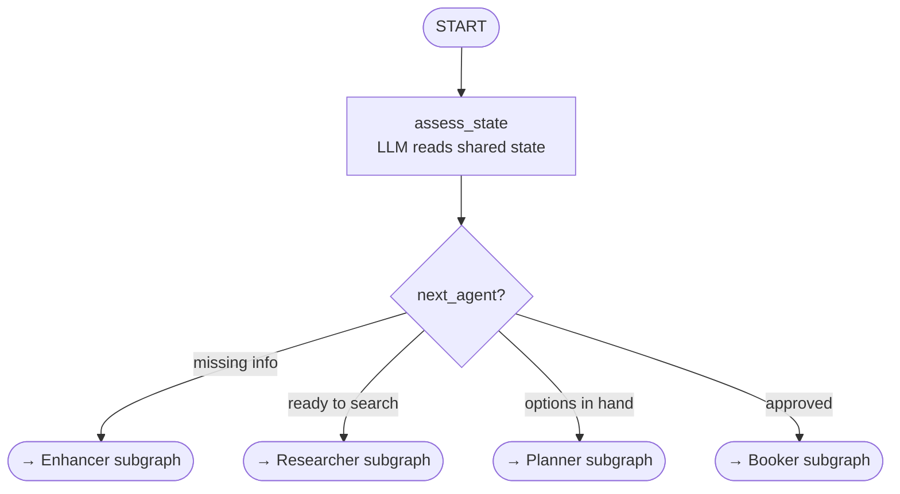
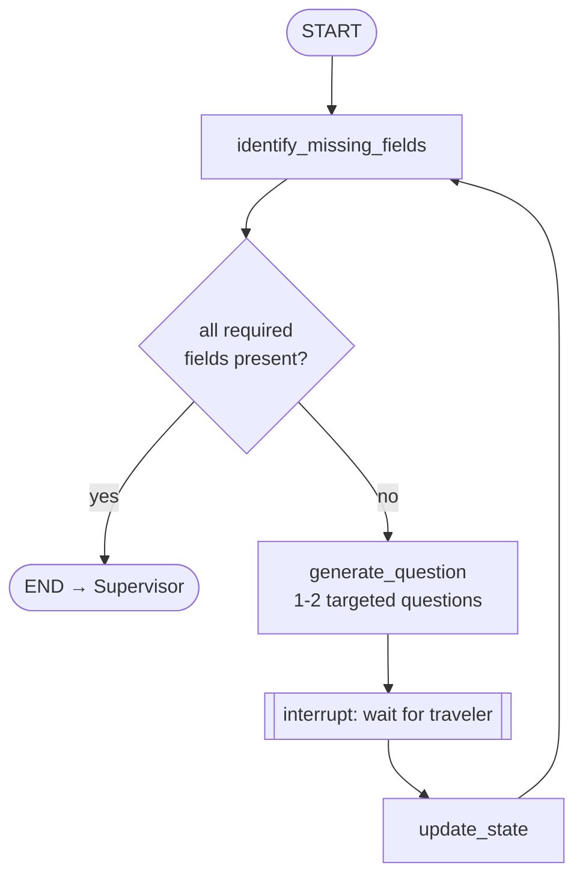
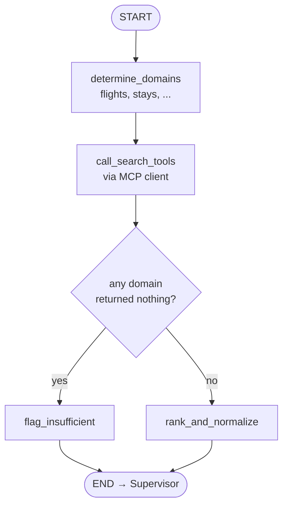
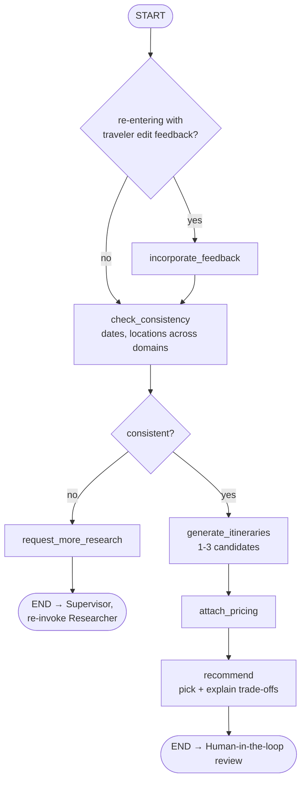
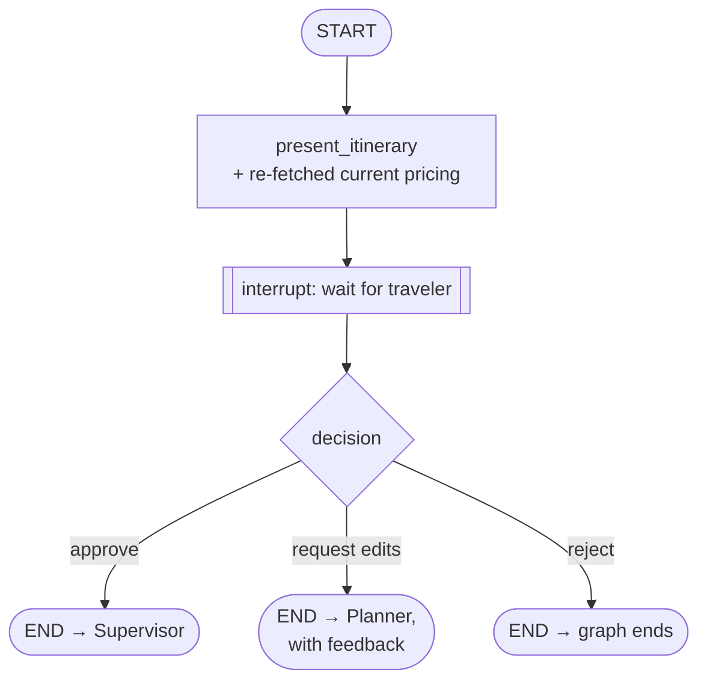
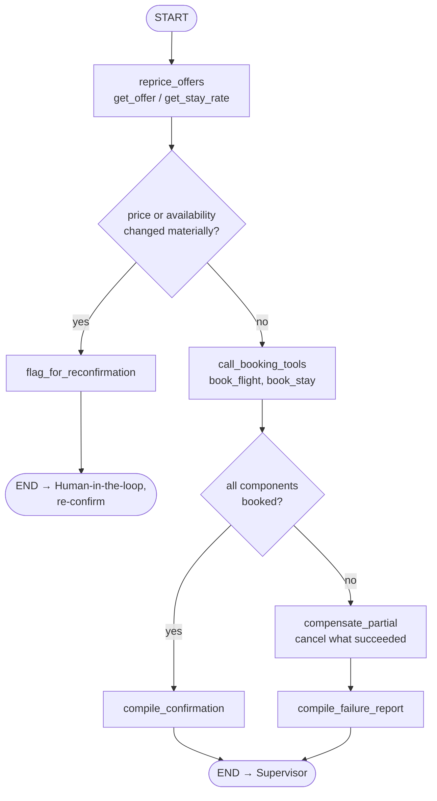

# AI Trip Planner — Multi-Agent Architecture

## 1. Overview

The AI Trip Planner is a conversational agent that helps a traveler plan and book a
trip end-to-end. It uses a **supervisor multi-agent architecture** built on
**LangGraph**, where a top-level supervisor routes tasks to specialized sub-agents.
Each sub-agent interacts with the outside world exclusively through **MCP (Model
Context Protocol) servers**, which wrap external travel APIs (starting with Duffel).

**MVP scope:** flights and hotels (stays).
**Roadmap:** activities, rental cars, restaurants — added as new MCP servers and,
where needed, new sub-agent responsibilities, without changing the core graph shape.

---

## 2. High-level architecture

Enhancer, Researcher, and Planner all report back to the Supervisor, since their
outputs may need re-routing (e.g. Researcher's results might reveal a need for more
Enhancer clarification).

The Human-in-the-Loop Review is drawn as a hexagon, not a box, because it isn't an
agent — it's a LangGraph `interrupt` that pauses the graph and hands control back to
the traveler directly. The traveler has three options: **approve** (control returns
to the Supervisor, which is the only thing that can then route to Booker), **request
edits** (control returns to Planner with the traveler's feedback), or **reject**
(the graph ends — no further action is taken). Booker still has exactly one path
in — via the Supervisor, and only on the approve branch — so no booking can happen
without the traveler having explicitly seen and approved the final itinerary.

---

## 3. Agents

### 3.1 Supervisor Agent
- Entry point for every user turn.
- Decides which sub-agent(s) should handle the current request, based on conversation
  state and what the user just said.
- Owns the overall trip-planning state object (see §5) and decides when a trip
  request is "complete enough" to move from research → planning → booking.
- Does **not** call any MCP tools directly — it only orchestrates.

### 3.2 Enhancer Agent
- Triggered when the user's request is underspecified (missing dates, budget, number
  of travelers, origin city, etc.).
- Asks targeted follow-up questions, one or two at a time, rather than a long
  intake form.
- Writes clarified details back into shared state; hands control back to the
  supervisor once enough information exists to research.

### 3.3 Researcher Agent
- Given a well-specified request, calls `search_*` tools (flights, hotels, later
  activities/cars/restaurants) via the MCP client.
- Normalizes and ranks raw API results into a shortlist the Planner/user can reason
  about (price, duration, fit against stated preferences).
- Read-only — never calls a `book_*` tool.

### 3.4 Planner Agent
- Assembles researched options into a coherent trip proposal (e.g. a specific flight
  + a specific hotel that are date/location-consistent).
- Surfaces trade-offs to the user ("cheaper flight lands late, this hotel is closer
  to downtown but pricier").
- Produces the concrete itinerary that the user will be asked to confirm.

### 3.5 Booker Agent
- Only invoked by the Supervisor, and only after the traveler has approved the
  itinerary via Human-in-the-Loop Review (§3.6).
- Calls `book_*` tools via the MCP client to create real (or simulated, in test mode)
  orders.
- Reports back confirmation details (booking reference, price, status) or a
  structured failure (offer expired, sold out) for the supervisor/user to react to.

### 3.6 Human-in-the-Loop Review
- Not an agent — a LangGraph `interrupt` that pauses the graph and hands control
  directly to the traveler, immediately after the Planner produces an itinerary.
- Presents the finalized itinerary and re-fetched, current pricing.
- Three possible outcomes: **approve** (returns control to the Supervisor, which then
  invokes Booker), **request edits** (returns to Planner with feedback), or **reject**
  (ends the graph).
- No path from Supervisor or Planner reaches Booker directly — approval through this
  step is the only way in.
- Also used for post-booking actions with financial/irreversible consequences
  (cancellations, changes).

---

## 4. Tools and MCP servers

Each domain is served by its own MCP server, so each stays small, independently
testable, and independently deployable. All servers are custom-built (wrapping
official REST APIs directly) rather than third-party/community MCP packages, for
control over error handling, credential security, and long-term maintenance.

| Domain | MVP status | Backing API | Tools exposed |
|---|---|---|---|
| Flights | ✅ MVP | Duffel Flights API | `search_flights`, `get_offer`, `book_flight`, `get_booking`, `cancel_booking` |
| Hotels (Stays) | ✅ MVP | Duffel Stays API | `search_stays`, `get_stay_rate`, `book_stay`, `get_stay_booking`, `cancel_stay_booking` |
| Activities | 🔜 Phase 2 | TBD (search-only expected) | `search_activities` |
| Rental cars | 🔜 Phase 2 | TBD — no self-serve API confirmed yet; may require a mocked dataset | `search_cars`, `book_car` |
| Restaurants | 🔜 Phase 2 | TBD (search-only expected, e.g. Places-style API) | `search_restaurants` |

Design conventions applied consistently across all servers:
- `search_*` and `book_*` are always separate tools, never combined — this is what
  lets the Human-in-the-Loop review step sit between research and booking in the
  graph.
- Raw provider responses are trimmed/normalized before being returned to the agent —
  full API payloads are large and not LLM-context-friendly.
- Every tool handler catches provider-level errors (expired offer, sold out, invalid
  passenger data) and returns a structured error object, never a raw exception.

---

## 5. Memory

### Phase 1 (MVP): in-memory, single-session
- LangGraph's in-memory checkpointer holds conversation + trip state for the
  duration of a session (thread).
- State includes: clarified preferences, research results, current itinerary draft,
  booking status.
- No persistence across app restarts or separate sessions — acceptable for MVP demo
  purposes.

### Phase 2: cross-session, persistent memory
- Swap the in-memory checkpointer for a persistent one — SQLite is a reasonable
  starting point (LangGraph ships a built-in SQLite checkpointer, zero extra
  infrastructure to run), with Postgres or Redis as the upgrade path if the app
  needs concurrent multi-instance access later — so a returning user's prior trips
  and preferences carry over.
- Adds a long-term memory store (separate from per-thread checkpoint state) for
  durable facts about the user (home airport, seat preference, typical budget) that
  should inform future sessions, not just the current one.

---

## 6. Observability: LangSmith

LangSmith is used to trace and debug the multi-agent graph during development — every
agent handoff and every MCP tool call is expensive to debug via print statements alone
once the graph has five-plus nodes, so structured tracing is treated as a first-class
part of the architecture, not an afterthought.

Each trace captures: which agent handled a turn, what it decided, which MCP tool(s)
it called and with what arguments, and the raw vs. normalized tool response — useful
both for debugging during development and as a demonstrable artifact of the system's
reasoning for a portfolio walkthrough.

---

## 7. Per-agent LangGraph subgraphs

Each agent (except the Supervisor) is its own compiled LangGraph subgraph — with its
own nodes, conditional edges, and interrupts — invoked as a node from the top-level
graph.

### 7.1 Supervisor

The Supervisor doesn't need a multi-node subgraph of its own — it's a single LLM
call that reads shared state and emits a routing decision, which the top-level
graph's conditional edge acts on.

### 7.2 Enhancer subgraph

### 7.3 Researcher subgraph

### 7.4 Planner subgraph

### 7.5 Human-in-the-loop review

Not an agent subgraph, but worth showing at the same level of detail since it's a
distinct node in the top-level graph.

### 7.6 Booker subgraph

The reprice-before-booking step and the partial-failure compensation path (§7.6)
are both explicit nodes here, not afterthoughts — worth keeping even for MVP given
two independent booking calls are a realistic failure mode.

## 8. MVP definition of done

- Supervisor correctly routes between Enhancer → Researcher → Planner → Human-in-the-
  Loop Review → Booker for a flight-and-hotel trip request.
- Flights and Stays MCP servers, each wrapping Duffel's test-mode API, working
  end-to-end for search and (simulated) booking.
- No booking tool is ever called without the traveler explicitly approving via the
  Human-in-the-Loop interrupt.
- Conversation state persists for the duration of a session (Phase 1 memory).
- LangSmith tracing enabled for at least the Researcher and Booker agents' tool calls.

## 9. Roadmap beyond MVP

1. Add Activities MCP server (search-only).
2. Add Restaurants MCP server (search-only, booking likely out of reach without
   OpenTable/Resy-style partnership).
3. Resolve rental-car sourcing (real API vs. mocked dataset) and add Cars MCP server.
4. Move to persistent, cross-session memory (Phase 2).
5. Revisit whether any Phase-2 domain justifies moving from HITL-gated automatic
   booking to a different confirmation UX (e.g. batch-confirming a full itinerary at
   once rather than per-component).
