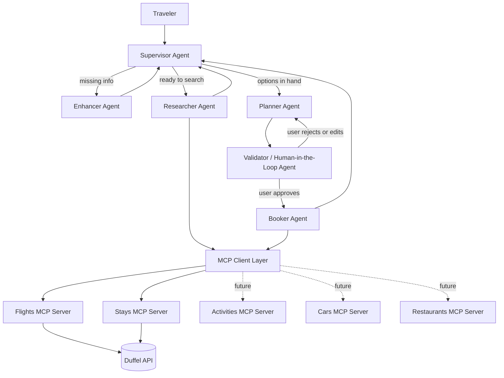
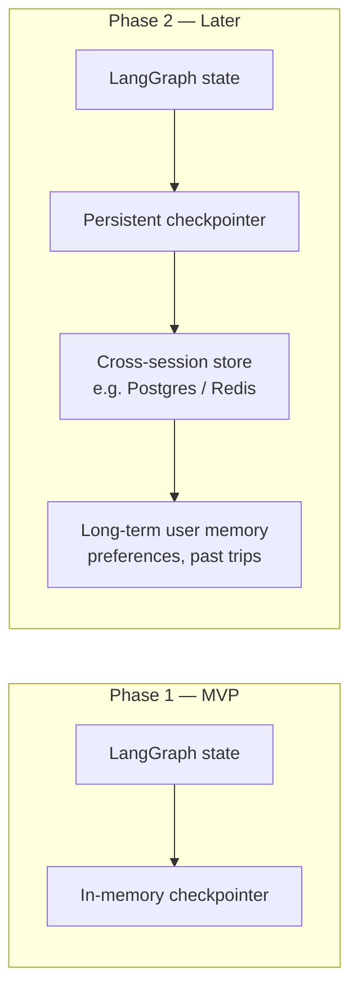
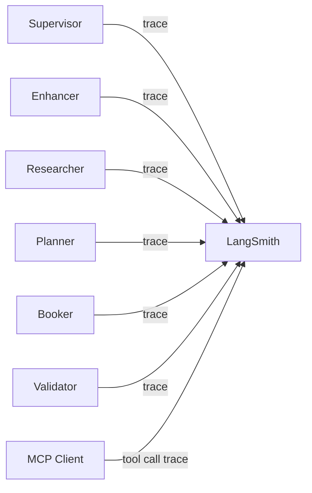

# AI Trip Planner — Multi-Agent Architecture

## 1. Overview

The AI Trip Planner is a conversational agent that helps a traveler plan and book a
trip end-to-end. It uses a **supervisor multi-agent architecture** built on
**LangGraph**, where a top-level supervisor routes tasks to specialized sub-agents.
Each sub-agent interacts with the outside world exclusively through **MCP (Model
Context Protocol) servers**, which wrap external travel APIs (starting with Duffel).

**MVP scope:** flights and hotels (stays).
**Roadmap:** activities, rental cars, restaurants — added as new MCP servers and,
where needed, new sub-agent responsibilities, without changing the core graph shape.

---

## 2. High-level architecture

Note what changed from a naive "supervisor fans out to five equal siblings" diagram:
**there is no edge from the Supervisor or the Planner directly to the Booker.** The
only path into the Booker node is through the Validator's "approved" edge. This
matters because a diagram (and the underlying graph) where all agents are parallel
children of the supervisor doesn't actually guarantee sequencing — the supervisor
could, in principle, route to Booker without ever visiting Validator. Making
Validator a structural gate — the sole in-edge to Booker — means "no booking without
confirmation" is enforced by the graph's shape itself, not by the supervisor's
judgment each turn.

Enhancer, Researcher, and Planner all report back to the Supervisor, since their
outputs may need re-routing (e.g. Researcher's results might reveal a need for more
Enhancer clarification). Once a Planner output is ready, though, it goes straight to
Validator — that step is not optional and not supervisor-mediated.

---

## 3. Agents

### 3.1 Supervisor Agent
- Entry point for every user turn.
- Decides which sub-agent(s) should handle the current request, based on conversation
  state and what the user just said.
- Owns the overall trip-planning state object (see §5) and decides when a trip
  request is "complete enough" to move from research → planning → booking.
- Does **not** call any MCP tools directly — it only orchestrates.

### 3.2 Enhancer Agent
- Triggered when the user's request is underspecified (missing dates, budget, number
  of travelers, origin city, etc.).
- Asks targeted follow-up questions, one or two at a time, rather than a long
  intake form.
- Writes clarified details back into shared state; hands control back to the
  supervisor once enough information exists to research.

### 3.3 Researcher Agent
- Given a well-specified request, calls `search_*` tools (flights, hotels, later
  activities/cars/restaurants) via the MCP client.
- Normalizes and ranks raw API results into a shortlist the Planner/user can reason
  about (price, duration, fit against stated preferences).
- Read-only — never calls a `book_*` tool.

### 3.4 Planner Agent
- Assembles researched options into a coherent trip proposal (e.g. a specific flight
  + a specific hotel that are date/location-consistent).
- Surfaces trade-offs to the user ("cheaper flight lands late, this hotel is closer
  to downtown but pricier").
- Produces the concrete itinerary that the user will be asked to confirm.

### 3.5 Booker Agent
- Only acts on an itinerary that has passed validation (§3.6).
- Calls `book_*` tools via the MCP client to create real (or simulated, in test mode)
  orders.
- Reports back confirmation details (booking reference, price, status) or a
  structured failure (offer expired, sold out) for the supervisor/user to react to.

### 3.6 Validator / Human-in-the-Loop Agent
- Sits directly before the Booker in the graph.
- Presents the finalized itinerary and re-fetched, current pricing to the user.
- **Requires explicit user confirmation before any booking tool is called** — this is
  a LangGraph `interrupt`, not a soft check. No path from Planner to Booker skips this
  node.
- Also used for post-booking actions with financial/irreversible consequences
  (cancellations, changes).

---

## 4. Tools and MCP servers

Each domain is served by its own MCP server, so each stays small, independently
testable, and independently deployable. All servers are custom-built (wrapping
official REST APIs directly) rather than third-party/community MCP packages, for
control over error handling, credential security, and long-term maintenance.

| Domain | MVP status | Backing API | Tools exposed |
|---|---|---|---|
| Flights | ✅ MVP | Duffel Flights API | `search_flights`, `get_offer`, `book_flight`, `get_booking`, `cancel_booking` |
| Hotels (Stays) | ✅ MVP | Duffel Stays API | `search_stays`, `get_stay_rate`, `book_stay`, `get_stay_booking`, `cancel_stay_booking` |
| Activities | 🔜 Phase 2 | TBD (search-only expected) | `search_activities` |
| Rental cars | 🔜 Phase 2 | TBD — no self-serve API confirmed yet; may require a mocked dataset | `search_cars`, `book_car` |
| Restaurants | 🔜 Phase 2 | TBD (search-only expected, e.g. Places-style API) | `search_restaurants` |

Design conventions applied consistently across all servers:
- `search_*` and `book_*` are always separate tools, never combined — this is what
  lets the Validator/HITL node sit between research and booking in the graph.
- Raw provider responses are trimmed/normalized before being returned to the agent —
  full API payloads are large and not LLM-context-friendly.
- Every tool handler catches provider-level errors (expired offer, sold out, invalid
  passenger data) and returns a structured error object, never a raw exception.

---

## 5. Memory

### Phase 1 (MVP): in-memory, single-session
- LangGraph's in-memory checkpointer holds conversation + trip state for the
  duration of a session (thread).
- State includes: clarified preferences, research results, current itinerary draft,
  booking status.
- No persistence across app restarts or separate sessions — acceptable for MVP demo
  purposes.

### Phase 2: cross-session, persistent memory
- Swap the in-memory checkpointer for a persistent one (e.g. Postgres- or
  Redis-backed) so a returning user's prior trips and preferences carry over.
- Adds a long-term memory store (separate from per-thread checkpoint state) for
  durable facts about the user (home airport, seat preference, typical budget) that
  should inform future sessions, not just the current one.

---

## 6. Observability: LangSmith

LangSmith is used to trace and debug the multi-agent graph during development — every
agent handoff and every MCP tool call is expensive to debug via print statements alone
once the graph has five-plus nodes, so structured tracing is treated as a first-class
part of the architecture, not an afterthought.

Each trace captures: which agent handled a turn, what it decided, which MCP tool(s)
it called and with what arguments, and the raw vs. normalized tool response — useful
both for debugging during development and as a demonstrable artifact of the system's
reasoning for a portfolio walkthrough.

---

## 7. MVP definition of done

- Supervisor correctly routes between Enhancer → Researcher → Planner → Validator →
  Booker for a flight-and-hotel trip request.
- Flights and Stays MCP servers, each wrapping Duffel's test-mode API, working
  end-to-end for search and (simulated) booking.
- No booking tool is ever called without passing through the Validator/HITL
  interrupt.
- Conversation state persists for the duration of a session (Phase 1 memory).
- LangSmith tracing enabled for at least the Researcher and Booker agents' tool calls.

## 8. Roadmap beyond MVP

1. Add Activities MCP server (search-only).
2. Add Restaurants MCP server (search-only, booking likely out of reach without
   OpenTable/Resy-style partnership).
3. Resolve rental-car sourcing (real API vs. mocked dataset) and add Cars MCP server.
4. Move to persistent, cross-session memory (Phase 2).
5. Revisit whether any Phase-2 domain justifies moving from HITL-gated automatic
   booking to a different confirmation UX (e.g. batch-confirming a full itinerary at
   once rather than per-component).
